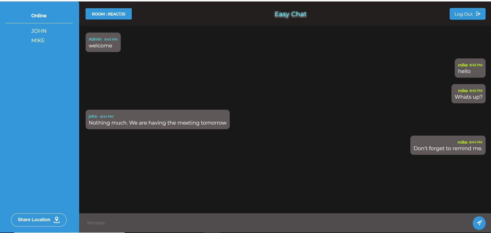

# Easy Chat

## About

> Easy Chat is a chat app where you can chat with anyone connected to the app without signing in . Be it one to one or with your group of friends. This app is built using Nodejs, Express, Socket.io and basic HTMLT and CSS




## How to get started

> You can start by entering a user name and the room you want to join

> User name is something that will be displayed to other users when you send a message. Its the display name

> Room is something where you can join. It can be any name as long as all of your friends are in the same room you all can chat. For example if you're the first one to initiate the chat then you can specify the room anything(lets say "bangalorian"). Then you can invite your friends to join the same room(in this case "bangalorian") and once you all are in the same room, you all can start chatting

## Rules for choosing username and room

-  You can choose anything as username and room as long as it is not used by another person

-  Remember the username and room both are not case sensitive

-  Than means "bangalorean" , "Bangalorean", and "BANGALOREAN" are all same

### Technologies

All the technologies that are used here are :

-  NodeJs - Evented I/O for the backend!
-  Express - Fast node.js network app framework
-  Socket.io - Real time communication and data transfer.
-  HTML & CSS - For front-end Design
-  Mustache - A logic-less template syntax
-  Moment - For date and time formating
-  QS - Query String parser

### Installation

Fork the repo and clone it to your local machine and run the following commands

```sh
$ cd real-time-chat-app
$ npm install
$ npm run dev/ npm start
```

#### CONTRIBUTIONS

> This app is not very complicated which maed it easy to contribute to. Also considering the HACKTOBERFEST in mind i'm maintaing this repository and will be updating issues.

> So feel free to submit a pull request(follow the abouve instructions)
